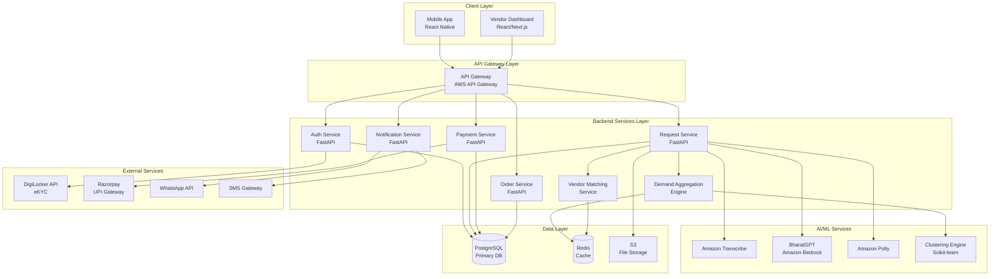

# Design Document: AgriSetu Platform

## Overview

AgriSetu is a comprehensive AI-driven collective procurement platform that connects farmers with verified vendors through intelligent demand aggregation. The system consists of three main components: a React Native mobile app for farmers, a React/Next.js web dashboard for vendors, and a FastAPI backend with AI/ML services. The platform leverages AWS services including Amazon Bedrock (BharatGPT), Amazon Transcribe, Amazon Polly, and integrates with government infrastructure (Aadhaar eKYC via DigiLocker) and payment systems (UPI via Razorpay).

## Architecture

### High-Level Architecture



### Technology Stack

**Frontend:**
- Mobile App: React Native with Expo
- Vendor Dashboard: React + Next.js 14 (App Router)
- Styling: Tailwind CSS
- State Management: React Context API + React Query
- Maps: React Native Maps / Google Maps API

**Backend:**
- API Framework: FastAPI (Python 3.11+)
- API Gateway: AWS API Gateway
- Compute: AWS Fargate (containerized services)

**AI/ML:**
- Voice Transcription: Amazon Transcribe
- Natural Language Processing: BharatGPT via Amazon Bedrock
- Text-to-Speech: Amazon Polly
- Clustering: Scikit-learn (K-means, DBSCAN)

**Data Storage:**
- Primary Database: PostgreSQL (Supabase/Neon)
- Cache: Redis
- File Storage: AWS S3
- Session Store: Redis

**External Integrations:**
- Authentication: DigiLocker API (Aadhaar eKYC)
- Payments: Razorpay (UPI, Escrow)
- Notifications: Twilio (SMS), WhatsApp Business API, Firebase Cloud Messaging (Push)

**DevOps:**
- CI/CD: GitHub Actions
- Monitoring: AWS CloudWatch, Sentry
- Logging: CloudWatch Logs
- Infrastructure: AWS (Fargate, RDS, ElastiCache, S3)

## Components and Interfaces

### 1. Mobile App (Farmer Interface)

**Technology:** React Native with Expo

**Key Screens:**
- Authentication Screen (Aadhaar eKYC)
- Home Dashboard (Active requests, orders)
- Voice Request Screen (Voice recording, transcription display)
- Cluster Visualization Screen (Map view, statistics)
- Quote Comparison Screen (Vendor quotes, selection)
- Payment Screen (UPI integration)
- Order Tracking Screen (Status timeline)
- Feedback Screen (Rating, review)

**Key Components:**
```typescript
// Voice Input Component
interface VoiceInputProps {
  language: string;
  onTranscriptionComplete: (text: string, structuredData: ProcurementRequest) => void;
  onError: (error: Error) => void;
}

// Cluster Map Component
interface ClusterMapProps {
  clusterId: string;
  farmers: FarmerLocation[];
  centerPoint: Coordinates;
  aggregateStats: ClusterStats;
}

// Quote Comparison Component
interface QuoteComparisonProps {
  quotes: VendorQuote[];
  onSelectQuote: (quoteId: string) => void;
  estimatedSavings: number;
}
```

**API Integration:**
- REST API calls to backend services
- WebSocket connection for real-time updates (cluster changes, quote notifications)
- Offline queue for pending actions


### 2. Vendor Dashboard (Web Interface)

**Technology:** React + Next.js 14 (App Router), Tailwind CSS

**Key Pages:**
- `/login` - Vendor authentication
- `/dashboard` - Overview metrics
- `/requests` - Procurement request inbox with filters
- `/requests/[id]` - Request detail and quote submission
- `/orders` - Order management
- `/orders/[id]` - Order detail and shipment updates
- `/products` - Product catalog management
- `/analytics` - Performance metrics and trends

**Key Components:**
```typescript
// Request Inbox Component
interface RequestInboxProps {
  filters: RequestFilters;
  onFilterChange: (filters: RequestFilters) => void;
  onSelectRequest: (requestId: string) => void;
}

// Quote Submission Form
interface QuoteFormProps {
  request: ProcurementRequest;
  onSubmit: (quote: VendorQuote) => Promise<void>;
  vendorProducts: Product[];
}

// Order Management Table
interface OrderTableProps {
  orders: Order[];
  onUpdateStatus: (orderId: string, status: OrderStatus, trackingInfo?: TrackingInfo) => void;
}
```

### 3. Authentication Service

**Technology:** FastAPI, DigiLocker API

**Endpoints:**
```python
POST /api/v1/auth/farmer/initiate-ekyc
  Request: { phone_number: str, redirect_url: str }
  Response: { request_id: str, digilocker_url: str }

POST /api/v1/auth/farmer/verify-ekyc
  Request: { request_id: str, code: str }
  Response: { access_token: str, refresh_token: str, farmer_profile: FarmerProfile }

POST /api/v1/auth/vendor/login
  Request: { email: str, password: str }
  Response: { access_token: str, refresh_token: str, vendor_profile: VendorProfile }

POST /api/v1/auth/refresh
  Request: { refresh_token: str }
  Response: { access_token: str }
```

**Key Functions:**
```python
async def initiate_aadhaar_ekyc(phone_number: str) -> DigiLockerSession:
    """Initiate Aadhaar eKYC flow via DigiLocker API"""
    
async def verify_aadhaar_ekyc(request_id: str, code: str) -> AadhaarData:
    """Verify eKYC response and extract Aadhaar reference"""
    
async def create_or_update_farmer(aadhaar_ref: str, profile_data: dict) -> Farmer:
    """Create new farmer or update existing profile"""
    
async def generate_tokens(user_id: str, role: str) -> TokenPair:
    """Generate JWT access and refresh tokens"""
```

**Security:**
- JWT tokens with 15-minute access token expiry, 30-day refresh token expiry
- Aadhaar reference stored (not full Aadhaar number)
- Password hashing using bcrypt for vendor accounts
- Rate limiting: 5 login attempts per 15 minutes per IP


### 4. Request Service (Voice Processing & Request Management)

**Technology:** FastAPI, Amazon Transcribe, BharatGPT (Amazon Bedrock), Amazon Polly

**Endpoints:**
```python
POST /api/v1/requests/voice/transcribe
  Request: { audio_file: File, language: str }
  Response: { transcription: str, confidence: float }

POST /api/v1/requests/voice/extract-data
  Request: { transcription: str, language: str }
  Response: { structured_data: ProcurementRequestData, missing_fields: list[str] }

POST /api/v1/requests/voice/synthesize
  Request: { text: str, language: str }
  Response: { audio_url: str }

POST /api/v1/requests
  Request: { farmer_id: str, product_type: str, quantity: float, unit: str, 
             quality_specs: str, delivery_location: Coordinates, 
             preferred_timeline: date }
  Response: { request_id: str, status: str }

GET /api/v1/requests/{request_id}
  Response: { request: ProcurementRequest, cluster: ClusterInfo, quotes: list[VendorQuote] }

GET /api/v1/requests/farmer/{farmer_id}
  Response: { requests: list[ProcurementRequest] }
```

**Key Functions:**
```python
async def transcribe_audio(audio_file: bytes, language: str) -> TranscriptionResult:
    """Use Amazon Transcribe to convert speech to text"""
    # Start transcription job
    # Poll for completion
    # Return transcription with confidence score
    
async def extract_structured_data(transcription: str, language: str) -> ProcurementRequestData:
    """Use BharatGPT on Amazon Bedrock to extract structured data from transcription"""
    # Construct prompt for BharatGPT
    prompt = f"""
    Extract procurement request details from the following text in {language}:
    {transcription}
    
    Extract and return JSON with:
    - product_type: type of agricultural input
    - quantity: numeric quantity
    - unit: unit of measurement
    - quality_specs: quality requirements
    - delivery_location: location description
    - preferred_timeline: delivery timeline
    """
    # Call Amazon Bedrock with BharatGPT model
    # Parse response JSON
    # Validate completeness
    # Return structured data with missing fields list
    
async def synthesize_speech(text: str, language: str) -> str:
    """Use Amazon Polly to convert text to speech"""
    # Call Amazon Polly with appropriate voice for language
    # Upload audio to S3
    # Return presigned URL
    
async def create_procurement_request(farmer_id: str, data: ProcurementRequestData) -> ProcurementRequest:
    """Create new procurement request and add to aggregation queue"""
    # Validate data
    # Create database record
    # Publish to aggregation queue
    # Return request object
```

**BharatGPT Integration Details:**
- Model: BharatGPT via Amazon Bedrock
- Use case: Natural language understanding for multilingual voice inputs
- Prompt engineering: Structured extraction with JSON output format
- Fallback: If confidence < 80%, request clarification from farmer


### 5. Demand Aggregation Engine

**Technology:** FastAPI, Scikit-learn, Redis

**Endpoints:**
```python
POST /api/v1/aggregation/trigger
  Request: { force: bool }
  Response: { job_id: str, status: str }

GET /api/v1/aggregation/clusters/{cluster_id}
  Response: { cluster: ClusterDetails, farmers: list[FarmerSummary], 
              aggregate_demand: dict, status: str }

GET /api/v1/aggregation/farmer/{farmer_id}/cluster
  Response: { cluster: ClusterDetails, position: str }
```

**Clustering Algorithm:**
```python
from sklearn.cluster import DBSCAN
from sklearn.preprocessing import StandardScaler
import numpy as np

async def cluster_procurement_requests() -> list[Cluster]:
    """
    Cluster farmers based on geographic proximity and product similarity
    
    Algorithm: DBSCAN (Density-Based Spatial Clustering)
    - eps: 25km (maximum distance between points in a cluster)
    - min_samples: 5 (minimum farmers to form a cluster)
    
    Features:
    - Geographic coordinates (latitude, longitude) - weighted 60%
    - Product type (one-hot encoded) - weighted 30%
    - Quantity (normalized) - weighted 10%
    """
    # Fetch pending requests from database
    requests = await get_pending_requests()
    
    # Prepare feature matrix
    features = []
    for req in requests:
        geo_features = [req.latitude, req.longitude]
        product_features = encode_product_type(req.product_type)
        quantity_feature = [normalize_quantity(req.quantity)]
        
        # Apply weights
        weighted_features = (
            np.array(geo_features) * 0.6 +
            np.array(product_features) * 0.3 +
            np.array(quantity_feature) * 0.1
        )
        features.append(weighted_features)
    
    # Standardize features
    scaler = StandardScaler()
    features_scaled = scaler.fit_transform(features)
    
    # Apply DBSCAN clustering
    clustering = DBSCAN(eps=0.5, min_samples=5, metric='euclidean')
    labels = clustering.fit_predict(features_scaled)
    
    # Create cluster objects
    clusters = []
    for cluster_id in set(labels):
        if cluster_id == -1:  # Noise points (not in any cluster)
            continue
            
        cluster_requests = [req for i, req in enumerate(requests) if labels[i] == cluster_id]
        
        cluster = Cluster(
            id=generate_cluster_id(),
            farmer_ids=[req.farmer_id for req in cluster_requests],
            request_ids=[req.id for req in cluster_requests],
            centroid=calculate_centroid(cluster_requests),
            aggregate_demand=calculate_aggregate_demand(cluster_requests),
            status='ready' if len(cluster_requests) >= 5 else 'forming'
        )
        clusters.append(cluster)
    
    # Cache clusters in Redis
    await cache_clusters(clusters)
    
    return clusters

def calculate_centroid(requests: list[ProcurementRequest]) -> Coordinates:
    """Calculate geographic centroid of cluster"""
    avg_lat = sum(r.latitude for r in requests) / len(requests)
    avg_lon = sum(r.longitude for r in requests) / len(requests)
    return Coordinates(latitude=avg_lat, longitude=avg_lon)

def calculate_aggregate_demand(requests: list[ProcurementRequest]) -> dict:
    """Calculate total demand by product type"""
    demand = {}
    for req in requests:
        key = f"{req.product_type}_{req.unit}"
        demand[key] = demand.get(key, 0) + req.quantity
    return demand
```

**Scheduling:**
- Runs every 6 hours via scheduled job
- Can be triggered manually via API
- Processes up to 10,000 requests per run


### 6. Vendor Matching Service

**Technology:** FastAPI, Redis

**Endpoints:**
```python
POST /api/v1/matching/match-vendors
  Request: { cluster_id: str }
  Response: { matched_vendors: list[VendorMatch], notification_sent: bool }

GET /api/v1/matching/vendor/{vendor_id}/opportunities
  Response: { opportunities: list[ProcurementOpportunity] }
```

**Matching Algorithm:**
```python
async def match_vendors_to_cluster(cluster: Cluster) -> list[VendorMatch]:
    """
    Score and rank vendors for a procurement cluster
    
    Scoring weights:
    - Proximity: 30%
    - Pricing: 35%
    - Reputation: 20%
    - Delivery capability: 10%
    - Credit terms: 5%
    """
    # Get all verified vendors who service the cluster region
    vendors = await get_eligible_vendors(cluster.centroid, radius_km=100)
    
    vendor_scores = []
    for vendor in vendors:
        # Calculate proximity score (0-100)
        distance_km = calculate_distance(vendor.location, cluster.centroid)
        proximity_score = max(0, 100 - (distance_km / 100) * 100)
        
        # Calculate pricing score (0-100)
        # Based on historical pricing compared to market average
        pricing_score = await calculate_pricing_score(vendor.id, cluster.aggregate_demand)
        
        # Calculate reputation score (0-100)
        # Based on ratings with recency weighting
        reputation_score = await calculate_reputation_score(vendor.id)
        
        # Calculate delivery capability score (0-100)
        # Based on on-time delivery percentage
        delivery_score = await calculate_delivery_score(vendor.id)
        
        # Calculate credit terms score (0-100)
        # Based on payment flexibility offered
        credit_score = calculate_credit_score(vendor.credit_terms)
        
        # Calculate weighted total score
        total_score = (
            proximity_score * 0.30 +
            pricing_score * 0.35 +
            reputation_score * 0.20 +
            delivery_score * 0.10 +
            credit_score * 0.05
        )
        
        vendor_scores.append(VendorMatch(
            vendor_id=vendor.id,
            vendor_name=vendor.name,
            total_score=total_score,
            proximity_score=proximity_score,
            pricing_score=pricing_score,
            reputation_score=reputation_score,
            delivery_score=delivery_score,
            credit_score=credit_score,
            distance_km=distance_km
        ))
    
    # Sort by total score and return top 3
    vendor_scores.sort(key=lambda x: x.total_score, reverse=True)
    top_vendors = vendor_scores[:3]
    
    # Notify selected vendors
    await notify_vendors(top_vendors, cluster)
    
    return top_vendors

async def calculate_reputation_score(vendor_id: str) -> float:
    """Calculate reputation score with recency weighting"""
    # Get ratings from last 12 months
    ratings = await get_vendor_ratings(vendor_id, months=12)
    
    if not ratings:
        return 50.0  # Neutral score for new vendors
    
    # Apply recency weighting: last 6 months = 70%, older = 30%
    recent_ratings = [r for r in ratings if r.age_months <= 6]
    older_ratings = [r for r in ratings if r.age_months > 6]
    
    recent_avg = sum(r.rating for r in recent_ratings) / len(recent_ratings) if recent_ratings else 0
    older_avg = sum(r.rating for r in older_ratings) / len(older_ratings) if older_ratings else 0
    
    weighted_avg = (recent_avg * 0.7 + older_avg * 0.3) if older_ratings else recent_avg
    
    # Convert 1-5 rating to 0-100 score
    return (weighted_avg / 5.0) * 100
```


### 7. Payment Service

**Technology:** FastAPI, Razorpay, PostgreSQL

**Endpoints:**
```python
POST /api/v1/payments/initiate
  Request: { order_id: str, amount: float, farmer_id: str }
  Response: { payment_id: str, upi_intent: str, razorpay_order_id: str }

POST /api/v1/payments/webhook
  Request: { razorpay_signature: str, payload: dict }
  Response: { status: str }

POST /api/v1/payments/confirm-delivery
  Request: { order_id: str, farmer_id: str, confirmation_code: str }
  Response: { status: str, funds_released: bool }

POST /api/v1/payments/dispute
  Request: { order_id: str, farmer_id: str, dispute_type: str, description: str, evidence: list[str] }
  Response: { dispute_id: str, status: str }
```

**Escrow Flow:**
```python
async def initiate_payment(order_id: str, amount: float, farmer_id: str) -> PaymentSession:
    """
    Initiate UPI payment with escrow
    
    Flow:
    1. Create Razorpay order
    2. Generate UPI intent
    3. Create escrow record in database
    4. Return payment details to farmer
    """
    # Create Razorpay order
    razorpay_order = razorpay_client.order.create({
        'amount': int(amount * 100),  # Convert to paise
        'currency': 'INR',
        'receipt': f'order_{order_id}',
        'notes': {
            'order_id': order_id,
            'farmer_id': farmer_id,
            'escrow': 'true'
        }
    })
    
    # Create escrow record
    escrow = await create_escrow_record(
        order_id=order_id,
        amount=amount,
        razorpay_order_id=razorpay_order['id'],
        status='pending'
    )
    
    # Generate UPI intent
    upi_intent = f"upi://pay?pa={MERCHANT_VPA}&pn={MERCHANT_NAME}&am={amount}&tr={razorpay_order['id']}"
    
    return PaymentSession(
        payment_id=escrow.id,
        razorpay_order_id=razorpay_order['id'],
        upi_intent=upi_intent,
        amount=amount
    )

async def handle_payment_webhook(signature: str, payload: dict) -> None:
    """
    Handle Razorpay webhook for payment status updates
    
    Events:
    - payment.captured: Move funds to escrow
    - payment.failed: Mark payment as failed
    """
    # Verify webhook signature
    if not verify_razorpay_signature(signature, payload):
        raise SecurityError("Invalid webhook signature")
    
    event = payload['event']
    payment_data = payload['payload']['payment']['entity']
    
    if event == 'payment.captured':
        # Update escrow status
        order_id = payment_data['notes']['order_id']
        await update_escrow_status(order_id, 'held')
        await update_order_status(order_id, 'payment_received')
        
        # Notify vendor to ship
        await notify_vendor_to_ship(order_id)

async def release_escrow_funds(order_id: str) -> None:
    """
    Release funds from escrow to vendor after delivery confirmation
    
    Flow:
    1. Verify delivery confirmation
    2. Transfer funds to vendor account
    3. Update escrow status
    4. Notify both parties
    """
    escrow = await get_escrow_by_order(order_id)
    order = await get_order(order_id)
    
    # Transfer funds to vendor via Razorpay
    transfer = razorpay_client.transfer.create({
        'account': order.vendor.razorpay_account_id,
        'amount': int(escrow.amount * 100),
        'currency': 'INR',
        'notes': {
            'order_id': order_id
        }
    })
    
    # Update escrow status
    await update_escrow_status(order_id, 'released')
    
    # Notify parties
    await notify_funds_released(order_id)
```


### 8. Order Service

**Technology:** FastAPI, PostgreSQL, WebSocket

**Endpoints:**
```python
POST /api/v1/orders
  Request: { farmer_id: str, quote_id: str }
  Response: { order_id: str, status: str }

GET /api/v1/orders/{order_id}
  Response: { order: OrderDetails, timeline: list[StatusUpdate] }

PUT /api/v1/orders/{order_id}/status
  Request: { status: str, tracking_info?: TrackingInfo }
  Response: { order: OrderDetails }

POST /api/v1/orders/{order_id}/confirm-delivery
  Request: { farmer_id: str, confirmation_code: str }
  Response: { status: str }

GET /api/v1/orders/farmer/{farmer_id}
  Response: { orders: list[Order] }

GET /api/v1/orders/vendor/{vendor_id}
  Response: { orders: list[Order] }

WebSocket /api/v1/orders/ws/{order_id}
  Real-time order status updates
```

**Order State Machine:**
```python
from enum import Enum

class OrderStatus(Enum):
    CONFIRMED = "confirmed"
    PAYMENT_PENDING = "payment_pending"
    PAYMENT_RECEIVED = "payment_received"
    PROCESSING = "processing"
    SHIPPED = "shipped"
    OUT_FOR_DELIVERY = "out_for_delivery"
    DELIVERED = "delivered"
    COMPLETED = "completed"
    DISPUTED = "disputed"
    CANCELLED = "cancelled"

# Valid state transitions
VALID_TRANSITIONS = {
    OrderStatus.CONFIRMED: [OrderStatus.PAYMENT_PENDING, OrderStatus.CANCELLED],
    OrderStatus.PAYMENT_PENDING: [OrderStatus.PAYMENT_RECEIVED, OrderStatus.CANCELLED],
    OrderStatus.PAYMENT_RECEIVED: [OrderStatus.PROCESSING, OrderStatus.CANCELLED],
    OrderStatus.PROCESSING: [OrderStatus.SHIPPED, OrderStatus.CANCELLED],
    OrderStatus.SHIPPED: [OrderStatus.OUT_FOR_DELIVERY, OrderStatus.DISPUTED],
    OrderStatus.OUT_FOR_DELIVERY: [OrderStatus.DELIVERED, OrderStatus.DISPUTED],
    OrderStatus.DELIVERED: [OrderStatus.COMPLETED, OrderStatus.DISPUTED],
    OrderStatus.COMPLETED: [],
    OrderStatus.DISPUTED: [OrderStatus.COMPLETED, OrderStatus.CANCELLED],
    OrderStatus.CANCELLED: []
}

async def update_order_status(order_id: str, new_status: OrderStatus, 
                              tracking_info: TrackingInfo = None) -> Order:
    """Update order status with validation"""
    order = await get_order(order_id)
    
    # Validate transition
    if new_status not in VALID_TRANSITIONS[order.status]:
        raise InvalidTransitionError(f"Cannot transition from {order.status} to {new_status}")
    
    # Update order
    order.status = new_status
    order.updated_at = datetime.utcnow()
    
    if tracking_info:
        order.tracking_info = tracking_info
    
    # Create timeline entry
    await create_status_update(order_id, new_status, tracking_info)
    
    # Save to database
    await save_order(order)
    
    # Notify farmer via WebSocket and push notification
    await notify_order_update(order)
    
    # Trigger side effects
    if new_status == OrderStatus.DELIVERED:
        await prompt_delivery_confirmation(order_id)
    elif new_status == OrderStatus.COMPLETED:
        await prompt_feedback(order_id)
        await release_escrow_funds(order_id)
    
    return order
```


### 9. Notification Service

**Technology:** FastAPI, Twilio (SMS), WhatsApp Business API, Firebase Cloud Messaging

**Endpoints:**
```python
POST /api/v1/notifications/send
  Request: { user_id: str, channels: list[str], template: str, data: dict, priority: str }
  Response: { notification_id: str, status: dict }

GET /api/v1/notifications/user/{user_id}/preferences
  Response: { preferences: NotificationPreferences }

PUT /api/v1/notifications/user/{user_id}/preferences
  Request: { preferences: NotificationPreferences }
  Response: { status: str }
```

**Notification Templates:**
```python
NOTIFICATION_TEMPLATES = {
    'cluster_formed': {
        'sms': 'Your request has been grouped with {count} farmers. Total quantity: {quantity}. View details: {link}',
        'whatsapp': 'Great news! Your procurement request is now part of a cluster with {count} farmers...',
        'push': {
            'title': 'Cluster Formed',
            'body': 'Your request joined a cluster of {count} farmers'
        }
    },
    'quotes_received': {
        'sms': 'You have {count} new quotes. Best price: ₹{best_price}. View: {link}',
        'whatsapp': 'New quotes received for your request...',
        'push': {
            'title': 'New Quotes Available',
            'body': '{count} vendors have submitted quotes'
        }
    },
    'payment_received': {
        'sms': 'Payment of ₹{amount} received. Order #{order_id} confirmed.',
        'whatsapp': 'Payment confirmed! Your order is being processed...',
        'push': {
            'title': 'Payment Confirmed',
            'body': 'Order #{order_id} is confirmed'
        }
    },
    'order_shipped': {
        'sms': 'Order #{order_id} shipped. Track: {tracking_url}',
        'whatsapp': 'Your order is on the way! Tracking: {tracking_url}',
        'push': {
            'title': 'Order Shipped',
            'body': 'Track your delivery'
        }
    }
}

async def send_notification(user_id: str, template: str, data: dict, 
                           channels: list[str], priority: str = 'normal') -> dict:
    """
    Send multi-channel notification
    
    Priority levels:
    - critical: SMS + WhatsApp + Push
    - high: WhatsApp + Push
    - normal: Push only
    """
    user = await get_user(user_id)
    preferences = await get_notification_preferences(user_id)
    
    results = {}
    
    # Determine channels based on priority and preferences
    if priority == 'critical':
        channels = ['sms', 'whatsapp', 'push']
    elif priority == 'high':
        channels = ['whatsapp', 'push']
    
    # Filter by user preferences
    enabled_channels = [ch for ch in channels if preferences.get(ch, True)]
    
    # Send via each channel
    for channel in enabled_channels:
        try:
            if channel == 'sms':
                result = await send_sms(user.phone, template, data)
            elif channel == 'whatsapp':
                result = await send_whatsapp(user.phone, template, data)
            elif channel == 'push':
                result = await send_push(user.device_tokens, template, data)
            
            results[channel] = {'status': 'sent', 'id': result.id}
        except Exception as e:
            results[channel] = {'status': 'failed', 'error': str(e)}
            # Retry logic with exponential backoff
            await schedule_retry(user_id, channel, template, data)
    
    return results
```


## Data Models

### Core Entities

```python
from datetime import datetime, date
from enum import Enum
from pydantic import BaseModel, Field

class Farmer(BaseModel):
    id: str
    aadhaar_ref: str  # Aadhaar reference number (not full Aadhaar)
    name: str
    phone: str
    language: str
    village: str
    district: str
    state: str
    location: Coordinates
    created_at: datetime
    last_login: datetime

class Vendor(BaseModel):
    id: str
    name: str
    email: str
    phone: str
    business_registration: str
    tax_id: str
    location: Coordinates
    service_radius_km: int
    verification_status: str  # verified, pending, rejected
    verification_date: datetime
    razorpay_account_id: str
    average_rating: float
    total_orders: int
    on_time_delivery_rate: float
    created_at: datetime

class ProcurementRequest(BaseModel):
    id: str
    farmer_id: str
    product_type: str
    quantity: float
    unit: str
    quality_specs: str
    delivery_location: Coordinates
    delivery_address: str
    preferred_timeline: date
    status: str  # pending, clustered, quoted, ordered
    cluster_id: str | None
    created_at: datetime
    updated_at: datetime

class Cluster(BaseModel):
    id: str
    farmer_ids: list[str]
    request_ids: list[str]
    centroid: Coordinates
    aggregate_demand: dict[str, float]  # product_unit -> quantity
    status: str  # forming, ready, matched, completed
    matched_vendor_ids: list[str]
    created_at: datetime
    expires_at: datetime

class VendorQuote(BaseModel):
    id: str
    vendor_id: str
    cluster_id: str
    request_ids: list[str]
    product_type: str
    unit_price: float
    total_price: float
    quantity: float
    unit: str
    delivery_timeline_days: int
    payment_terms: str
    quality_certifications: list[str]
    expires_at: datetime
    created_at: datetime

class Order(BaseModel):
    id: str
    farmer_id: str
    vendor_id: str
    quote_id: str
    cluster_id: str | None
    product_type: str
    quantity: float
    unit: str
    unit_price: float
    total_price: float
    delivery_address: str
    delivery_location: Coordinates
    status: OrderStatus
    payment_status: str  # pending, held_in_escrow, released, refunded
    tracking_info: TrackingInfo | None
    created_at: datetime
    updated_at: datetime
    delivered_at: datetime | None

class TrackingInfo(BaseModel):
    carrier: str
    tracking_number: str
    current_location: str
    estimated_delivery: date
    last_updated: datetime

class Coordinates(BaseModel):
    latitude: float
    longitude: float

class Payment(BaseModel):
    id: str
    order_id: str
    farmer_id: str
    vendor_id: str
    amount: float
    razorpay_order_id: str
    razorpay_payment_id: str | None
    status: str  # pending, captured, held_in_escrow, released, failed, refunded
    escrow_release_date: datetime | None
    created_at: datetime
    updated_at: datetime

class Feedback(BaseModel):
    id: str
    order_id: str
    farmer_id: str
    vendor_id: str
    rating: int  # 1-5
    review: str | None
    categories: dict[str, int]  # quality, delivery, communication -> 1-5
    flagged: bool
    created_at: datetime

class Dispute(BaseModel):
    id: str
    order_id: str
    farmer_id: str
    vendor_id: str
    dispute_type: str  # quality_issue, delivery_delay, quantity_mismatch, pricing_discrepancy
    description: str
    evidence_urls: list[str]
    status: str  # open, under_review, resolved, closed
    resolution: str | None
    created_at: datetime
    resolved_at: datetime | None
```


### Database Schema

```sql
-- Farmers table
CREATE TABLE farmers (
    id UUID PRIMARY KEY DEFAULT gen_random_uuid(),
    aadhaar_ref VARCHAR(50) UNIQUE NOT NULL,
    name VARCHAR(255) NOT NULL,
    phone VARCHAR(15) UNIQUE NOT NULL,
    language VARCHAR(10) NOT NULL,
    village VARCHAR(255),
    district VARCHAR(255),
    state VARCHAR(255),
    latitude DECIMAL(10, 8),
    longitude DECIMAL(11, 8),
    created_at TIMESTAMP DEFAULT NOW(),
    last_login TIMESTAMP,
    INDEX idx_phone (phone),
    INDEX idx_location (latitude, longitude)
);

-- Vendors table
CREATE TABLE vendors (
    id UUID PRIMARY KEY DEFAULT gen_random_uuid(),
    name VARCHAR(255) NOT NULL,
    email VARCHAR(255) UNIQUE NOT NULL,
    phone VARCHAR(15) NOT NULL,
    password_hash VARCHAR(255) NOT NULL,
    business_registration VARCHAR(100),
    tax_id VARCHAR(50),
    latitude DECIMAL(10, 8),
    longitude DECIMAL(11, 8),
    service_radius_km INT DEFAULT 50,
    verification_status VARCHAR(20) DEFAULT 'pending',
    verification_date TIMESTAMP,
    razorpay_account_id VARCHAR(100),
    average_rating DECIMAL(3, 2) DEFAULT 0,
    total_orders INT DEFAULT 0,
    on_time_delivery_rate DECIMAL(5, 2) DEFAULT 0,
    created_at TIMESTAMP DEFAULT NOW(),
    INDEX idx_email (email),
    INDEX idx_verification (verification_status),
    INDEX idx_location (latitude, longitude)
);

-- Procurement requests table
CREATE TABLE procurement_requests (
    id UUID PRIMARY KEY DEFAULT gen_random_uuid(),
    farmer_id UUID REFERENCES farmers(id),
    product_type VARCHAR(100) NOT NULL,
    quantity DECIMAL(10, 2) NOT NULL,
    unit VARCHAR(20) NOT NULL,
    quality_specs TEXT,
    latitude DECIMAL(10, 8) NOT NULL,
    longitude DECIMAL(11, 8) NOT NULL,
    delivery_address TEXT NOT NULL,
    preferred_timeline DATE,
    status VARCHAR(20) DEFAULT 'pending',
    cluster_id UUID,
    created_at TIMESTAMP DEFAULT NOW(),
    updated_at TIMESTAMP DEFAULT NOW(),
    INDEX idx_farmer (farmer_id),
    INDEX idx_status (status),
    INDEX idx_cluster (cluster_id),
    INDEX idx_location (latitude, longitude)
);

-- Clusters table
CREATE TABLE clusters (
    id UUID PRIMARY KEY DEFAULT gen_random_uuid(),
    centroid_lat DECIMAL(10, 8) NOT NULL,
    centroid_lon DECIMAL(11, 8) NOT NULL,
    aggregate_demand JSONB NOT NULL,
    status VARCHAR(20) DEFAULT 'forming',
    created_at TIMESTAMP DEFAULT NOW(),
    expires_at TIMESTAMP,
    INDEX idx_status (status),
    INDEX idx_centroid (centroid_lat, centroid_lon)
);

-- Vendor quotes table
CREATE TABLE vendor_quotes (
    id UUID PRIMARY KEY DEFAULT gen_random_uuid(),
    vendor_id UUID REFERENCES vendors(id),
    cluster_id UUID REFERENCES clusters(id),
    product_type VARCHAR(100) NOT NULL,
    unit_price DECIMAL(10, 2) NOT NULL,
    total_price DECIMAL(12, 2) NOT NULL,
    quantity DECIMAL(10, 2) NOT NULL,
    unit VARCHAR(20) NOT NULL,
    delivery_timeline_days INT NOT NULL,
    payment_terms VARCHAR(100),
    quality_certifications JSONB,
    expires_at TIMESTAMP NOT NULL,
    created_at TIMESTAMP DEFAULT NOW(),
    INDEX idx_vendor (vendor_id),
    INDEX idx_cluster (cluster_id)
);

-- Orders table
CREATE TABLE orders (
    id UUID PRIMARY KEY DEFAULT gen_random_uuid(),
    farmer_id UUID REFERENCES farmers(id),
    vendor_id UUID REFERENCES vendors(id),
    quote_id UUID REFERENCES vendor_quotes(id),
    cluster_id UUID REFERENCES clusters(id),
    product_type VARCHAR(100) NOT NULL,
    quantity DECIMAL(10, 2) NOT NULL,
    unit VARCHAR(20) NOT NULL,
    unit_price DECIMAL(10, 2) NOT NULL,
    total_price DECIMAL(12, 2) NOT NULL,
    delivery_address TEXT NOT NULL,
    latitude DECIMAL(10, 8),
    longitude DECIMAL(11, 8),
    status VARCHAR(30) NOT NULL,
    payment_status VARCHAR(20) DEFAULT 'pending',
    tracking_info JSONB,
    created_at TIMESTAMP DEFAULT NOW(),
    updated_at TIMESTAMP DEFAULT NOW(),
    delivered_at TIMESTAMP,
    INDEX idx_farmer (farmer_id),
    INDEX idx_vendor (vendor_id),
    INDEX idx_status (status),
    INDEX idx_payment_status (payment_status)
);

-- Payments table
CREATE TABLE payments (
    id UUID PRIMARY KEY DEFAULT gen_random_uuid(),
    order_id UUID REFERENCES orders(id),
    farmer_id UUID REFERENCES farmers(id),
    vendor_id UUID REFERENCES vendors(id),
    amount DECIMAL(12, 2) NOT NULL,
    razorpay_order_id VARCHAR(100) UNIQUE,
    razorpay_payment_id VARCHAR(100),
    status VARCHAR(20) DEFAULT 'pending',
    escrow_release_date TIMESTAMP,
    created_at TIMESTAMP DEFAULT NOW(),
    updated_at TIMESTAMP DEFAULT NOW(),
    INDEX idx_order (order_id),
    INDEX idx_status (status),
    INDEX idx_razorpay_order (razorpay_order_id)
);

-- Feedback table
CREATE TABLE feedback (
    id UUID PRIMARY KEY DEFAULT gen_random_uuid(),
    order_id UUID REFERENCES orders(id),
    farmer_id UUID REFERENCES farmers(id),
    vendor_id UUID REFERENCES vendors(id),
    rating INT CHECK (rating >= 1 AND rating <= 5),
    review TEXT,
    categories JSONB,
    flagged BOOLEAN DEFAULT FALSE,
    created_at TIMESTAMP DEFAULT NOW(),
    INDEX idx_vendor (vendor_id),
    INDEX idx_order (order_id)
);

-- Disputes table
CREATE TABLE disputes (
    id UUID PRIMARY KEY DEFAULT gen_random_uuid(),
    order_id UUID REFERENCES orders(id),
    farmer_id UUID REFERENCES farmers(id),
    vendor_id UUID REFERENCES vendors(id),
    dispute_type VARCHAR(50) NOT NULL,
    description TEXT NOT NULL,
    evidence_urls JSONB,
    status VARCHAR(20) DEFAULT 'open',
    resolution TEXT,
    created_at TIMESTAMP DEFAULT NOW(),
    resolved_at TIMESTAMP,
    INDEX idx_order (order_id),
    INDEX idx_status (status)
);
```

